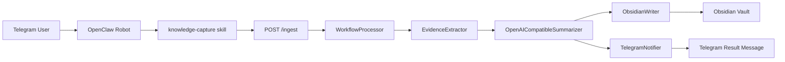

# OpenClaw Capture Workflow

`openclaw_capture_workflow` 是 OpenClaw 机器人的本地知识采集后端。

它解决的问题不是“怎么聊天”，而是：

- 用户把链接、视频、图文、截图发给机器人后
- 本地系统如何真正理解内容
- 如何把结果写进 Obsidian
- 如何把人能看懂的结果回到 Telegram

如果你只想一句话理解它：

> OpenClaw 负责收消息，这个项目负责看懂内容、写入笔记、把结果发回去。

---

## 1. 这个项目到底做什么

输入：

- Telegram 群聊 / 私聊里发给 OpenClaw 的消息
- 支持文本、URL、视频 URL、图片、混合输入

输出：

- 结构化 summary
- Obsidian 笔记
- Telegram 返回消息

主要目标：

- 替用户先看一遍内容
- 快速告诉用户“这是什么、值不值得继续看、最重要的点是什么”
- 把结果落到可复用的知识库里

---

## 2. 整体架构

详细版本见 [docs/ARCHITECTURE.md](/Users/boyuewu/Documents/Projects/AIProjects/openclaw_capture_workflow/docs/ARCHITECTURE.md)。

先看最核心的端到端流程：



分层职责：

1. 机器人入口：把消息变成标准 payload
2. 本地处理：抽取证据、做总结
3. 落库：写 Obsidian
4. 回执：发 Telegram 消息

---

## 3. 目录结构

```text
openclaw_capture_workflow/
├─ src/openclaw_capture_workflow/
│  ├─ server.py              # /ingest HTTP 入口
│  ├─ processor.py           # 主处理管线
│  ├─ extractor.py           # 证据抽取
│  ├─ summarizer.py          # 结构化总结
│  ├─ obsidian.py            # 写入 Obsidian
│  ├─ telegram.py            # 生成并发送 Telegram 返回
│  ├─ analyzer/              # URL 分析与浏览器抓取
│  └─ ...
├─ scripts/
│  ├─ video_subtitle_extract.py
│  ├─ video_audio_asr.py
│  ├─ video_audio_asr_apple.swift
│  ├─ video_keyframes_extract.py
│  ├─ run_robot_payload_replay.py
│  └─ run_live_validation.py
├─ docs/
│  ├─ ARCHITECTURE.md
│  ├─ LIVE_VALIDATION.md
│  ├─ NEXT_SESSION_HANDOFF.md
│  └─ TECHNICAL_HANDOFF.md
├─ openclaw-skill/
│  └─ knowledge-capture/
└─ tests/
```

---

## 4. 每一层用什么，优缺点是什么

### 4.1 机器人入口层

文件：

- [openclaw-skill/knowledge-capture/SKILL.md](/Users/boyuewu/Documents/Projects/AIProjects/openclaw_capture_workflow/openclaw-skill/knowledge-capture/SKILL.md)

做什么：

- 读取 Telegram 消息
- 归一化成 payload

输出字段：

- `chat_id`
- `reply_to_message_id`
- `request_id`
- `source_kind`
- `source_url`
- `raw_text`
- `image_refs`
- `platform_hint`
- `requested_output_lang`

优点：

- 入口统一
- 后端只处理一种 payload 格式

缺点：

- 如果这里把内容分错类，后面都跟着偏

### 4.2 HTTP 入口层

文件：

- [src/openclaw_capture_workflow/server.py](/Users/boyuewu/Documents/Projects/AIProjects/openclaw_capture_workflow/src/openclaw_capture_workflow/server.py)

技术：

- Python 内置 `http.server`

做什么：

- 提供 `POST /ingest`
- 提供 `GET /jobs/<id>`
- 提供 `GET /health`

优点：

- 轻量
- 本地启动简单

缺点：

- 不适合高并发生产服务

### 4.3 处理总管 WorkflowProcessor

文件：

- [src/openclaw_capture_workflow/processor.py](/Users/boyuewu/Documents/Projects/AIProjects/openclaw_capture_workflow/src/openclaw_capture_workflow/processor.py)

做什么：

- 控制 4 个阶段：
  - `extract`
  - `summarize`
  - `write_note`
  - `notify`
- 记录 job 状态、warning、错误

优点：

- 可观测性强
- 失败点好定位

缺点：

- 分支多
- 视频链路比较复杂

### 4.4 抽取层 EvidenceExtractor

文件：

- [src/openclaw_capture_workflow/extractor.py](/Users/boyuewu/Documents/Projects/AIProjects/openclaw_capture_workflow/src/openclaw_capture_workflow/extractor.py)

按输入类型分流：

- `pasted_text`
- `image`
- `video_url`
- `url`
- `mixed`

#### 网页 / 文本

主要依赖：

- 页面可见正文
- GitHub API
- 浏览器快照

优点：

- 对 README、文档站、普通网页效果稳定

缺点：

- 动态站和反爬站不稳定

#### 图片 / OCR

主要依赖：

- 本地 OCR
- 默认 Swift OCR

优点：

- 截图兜底能力好

缺点：

- OCR 一旦脏，后面 summary 也会被带歪

#### 视频

当前视频抽取组合：

1. 平台元数据
2. 字幕
3. 音轨转写
4. 关键帧
5. 关键帧 OCR
6. 评论补充

优点：

- 不依赖单一字幕
- B站 / 小红书效果已经明显好于早期版本

缺点：

- YouTube 容易被 bot check
- 小红书页面形态波动大
- 评论抓取依赖浏览器环境

### 4.5 总结层 Summarizer

文件：

- [src/openclaw_capture_workflow/summarizer.py](/Users/boyuewu/Documents/Projects/AIProjects/openclaw_capture_workflow/src/openclaw_capture_workflow/summarizer.py)

当前配置：

- 默认 `gpt-4o-mini`
- 通过 AIHubMix OpenAI-compatible API 调用

做什么：

- 把证据变成结构化 summary
- 输出：
  - `title`
  - `conclusion`
  - `bullets`
  - `coverage`
  - `confidence`
  - `follow_up_actions`

优点：

- 输出结构稳定
- 有 fallback 和质量检查

缺点：

- 如果抽取阶段信息太差，总结层很难完全救回来

### 4.6 ObsidianWriter

文件：

- [src/openclaw_capture_workflow/obsidian.py](/Users/boyuewu/Documents/Projects/AIProjects/openclaw_capture_workflow/src/openclaw_capture_workflow/obsidian.py)

做什么：

- 写笔记到 `Inbox/OpenClaw`
- 更新关键词索引
- 写 frontmatter

现在 frontmatter 会写：

- `source_url`
- `content_profile`
- `keyword_l1`
- `keyword_l2`
- 原生 `tags:`

优点：

- 归档路径稳定
- 支持 Obsidian 原生标签和项目自定义关键词索引双写

缺点：

- `keyword_l1` 规则还会误判，需持续修正

### 4.7 TelegramNotifier

文件：

- [src/openclaw_capture_workflow/telegram.py](/Users/boyuewu/Documents/Projects/AIProjects/openclaw_capture_workflow/src/openclaw_capture_workflow/telegram.py)

做什么：

- 生成用户最终看到的消息文本
- 真正发送到 Telegram

现在已经拆成两层：

- `build_result_message_payload()`：纯渲染
- `send_result()`：真实发送

优点：

- 可无副作用预览返回效果
- group / direct 都能测

缺点：

- 模板容易“回退成系统味”
- 视频类和普通网页类不能共用一套口吻

---

## 5. 现在到底用什么技术

### Playwright

用在：

- 浏览器渲染
- 动态网页抓取

优点：

- 稳
- 成熟

缺点：

- 重
- 对某些站点正文仍可能太短

### PinchTab

用在：

- Playwright 抓不到正文时的可选后端

优点：

- 可以做备用浏览器抓取层

缺点：

- 目前不是主路径
- 还没成为默认稳定方案

### yt-dlp

用在：

- YouTube / 小红书 / B站 视频下载
- 音频和关键帧前置处理

优点：

- 平台覆盖广

缺点：

- 对 YouTube 反 bot 很敏感
- 经常需要 cookies

### Apple SpeechTranscriber

用在：

- macOS 26+ 本地音轨转写

优点：

- 不依赖外部 STT key
- 对中文视频效果明显更稳

缺点：

- 机器依赖强
- 不是跨平台能力

### AIHubMix

用在：

- Summary 模型
- STT fallback
- note renderer

优点：

- 接 OpenAI-compatible 很方便

缺点：

- 外部依赖
- 成本和可用性受网络影响

### Obsidian

用在：

- 最终知识归档

优点：

- 最终结果可沉淀

缺点：

- 真跑测试时会污染真实 vault

### Telegram

用在：

- 返回最终处理结果

优点：

- 用户即时可见

缺点：

- 真发消息会污染真实群聊 / 私聊

---

## 6. 平台维度说明

### B站

当前情况：

- 效果最好
- 公开音轨 + 元数据 + 关键帧组合比较稳定

主要风险：

- 不一定有公开字幕
- 评论补充抓取会受浏览器环境影响

### 小红书视频

当前情况：

- 已经比之前强很多
- 音轨 + 关键帧 + OCR 组合能出 usable 结果

主要风险：

- 页面形态波动大
- 音频下载不一定稳定

### 小红书图文

当前情况：

- 可以走 URL / 网页链路
- 对“图文 note”是必须单独测的一条路径

主要风险：

- URL 是否真的是图文 note 而不是视频页，需要单独核

### YouTube

当前情况：

- 是最脆弱的平台

主要风险：

- `yt-dlp` 403
- `Sign in to confirm you’re not a bot`
- cookies 环境强依赖

---

## 7. 如何启动

### 7.1 配置

```bash
cp config.example.json config.json
cp .env.example .env
```

必须关注：

- `obsidian.vault_path`
- `telegram.result_bot_token`
- `summarizer.api_key`

### 7.2 安装依赖

系统依赖：

```bash
brew install yt-dlp ffmpeg
```

运行时依赖：

```bash
uv venv .venv-runtime
uv pip install --python .venv-runtime/bin/python beautifulsoup4 playwright fastapi uvicorn httpx
.venv-runtime/bin/python -m playwright install chromium
```

### 7.3 启服务

```bash
PYTHONPATH=src python3 -m openclaw_capture_workflow.cli serve --config config.json
```

---

## 8. 怎么验证它真的能跑

### 单元 / 集成测试

```bash
python3 -m unittest discover -s tests
```

### 回放机器人入口

```bash
python3 scripts/run_robot_payload_replay.py --limit 2
```

### 真实链路验证

```bash
python3 scripts/run_live_validation.py --config config.json
```

这个脚本会：

- 备份并清空 OpenClaw 托管的 Obsidian 区域
- 用真实配置跑样本
- 真写 Obsidian
- 真发 Telegram
- 输出 JSON 报告
- 更新 `docs/LIVE_VALIDATION.md`

---

## 9. 失败排查

### 问题：B站 / 小红书视频效果突然变差

优先检查：

- 字幕是否可用
- 音轨是否下载成功
- ASR 是否跑起来
- `video_story_blocks` 是否为空

### 问题：YouTube 失败

优先检查：

- `VIDEO_COOKIES_FROM_BROWSER`
- 本机浏览器 cookies 是否存在
- `yt-dlp` 是否被 bot check

### 问题：Obsidian 写出来又变官样文章

优先检查：

- 是否错误走回了旧 note renderer
- 视频笔记是否触发了“强证据直出正文”逻辑

### 问题：Telegram 返回又有模板味

优先检查：

- 是否走了视频专用渲染
- 是否误走了普通网页消息模板

---

## 10. 当前最真实的限制

- YouTube 仍然是最不稳定的平台
- 小红书图文 / 视频边界样本还不够多
- `keyword_l1` 分类规则还需要继续修
- “回给用户的文本”和“写进 Obsidian 的正文”必须持续保证同风格，否则很容易再次分叉

---

## 11. 下一步最值得做什么

如果只按优先级排：

1. 保证 Telegram 返回和 Obsidian 正文始终同风格
2. 做更多真实平台样本验证，尤其 YouTube 和小红书图文
3. 把关键词分类从启发式规则继续收紧

如果你要完整看链路设计，继续读：

- [docs/ARCHITECTURE.md](/Users/boyuewu/Documents/Projects/AIProjects/openclaw_capture_workflow/docs/ARCHITECTURE.md)
- [docs/LIVE_VALIDATION.md](/Users/boyuewu/Documents/Projects/AIProjects/openclaw_capture_workflow/docs/LIVE_VALIDATION.md)
