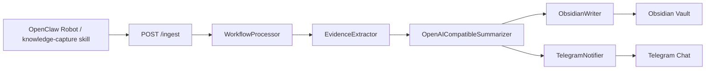

# Architecture

## 1. 项目定位

`openclaw_capture_workflow` 是 OpenClaw 机器人的本地处理后端。

它不负责“聊天入口”本身，而是负责把机器人收到的链接、视频、图文、截图、混合消息，变成：

1. 可理解的证据
2. 可读的总结
3. 可归档的 Obsidian 笔记
4. 可回到 Telegram 的结果消息

一句话说：

> OpenClaw 负责“收消息”，这个项目负责“真正看懂并落库”。

## 2. 端到端链路

更细的执行顺序：

1. 用户在群聊或私聊里触发 OpenClaw
2. `knowledge-capture` skill 归一化消息，形成 JSON payload
3. payload 发到本地 `POST /ingest`
4. `WorkflowProcessor` 创建 job，开始抽取证据
5. `EvidenceExtractor` 按内容类型分流
6. `OpenAICompatibleSummarizer` 生成结构化总结
7. `ObsidianWriter` 写入笔记和关键词索引
8. `TelegramNotifier` 把最终结果回发到 Telegram

## 3. 模块拆解

### 3.1 OpenClaw 机器人入口

责任：

- 接收用户消息
- 识别这是文本、图片、URL、视频 URL，还是混合输入
- 整理成稳定 payload

关键文件：

- [openclaw-skill/knowledge-capture/SKILL.md](/Users/boyuewu/Documents/Projects/AIProjects/openclaw_capture_workflow/openclaw-skill/knowledge-capture/SKILL.md)

输入：

- Telegram 用户消息

输出：

- `chat_id`
- `reply_to_message_id`
- `request_id`
- `source_kind`
- `source_url`
- `raw_text`
- `image_refs`
- `platform_hint`
- `requested_output_lang`

优点：

- 把机器人入口和本地处理解耦
- payload 格式稳定，便于回放测试

缺点 / 风险：

- 如果 skill 侧分类错了，本地链路会从错误入口开始
- `mixed` 内容如果在 skill 侧被裁剪，会直接损伤后面总结质量

### 3.2 `/ingest` HTTP 入口

责任：

- 接收标准 payload
- 转成 `IngestRequest`
- 进入异步处理队列

关键文件：

- [server.py](/Users/boyuewu/Documents/Projects/AIProjects/openclaw_capture_workflow/src/openclaw_capture_workflow/server.py)

技术：

- Python `http.server`
- `ThreadingHTTPServer`

优点：

- 依赖少
- 易于本地运行

缺点 / 风险：

- 不是高并发生产级 web server
- 主要适合本地自动化和个人工作流

### 3.3 WorkflowProcessor

责任：

- 管理 job 生命周期
- 串起 extract / summarize / write_note / notify 四个阶段
- 记录每一步状态、错误和 warning

关键文件：

- [processor.py](/Users/boyuewu/Documents/Projects/AIProjects/openclaw_capture_workflow/src/openclaw_capture_workflow/processor.py)

输入：

- `IngestRequest`

输出：

- job result
- summary
- note metadata
- notification status

优点：

- 有清晰 phase 状态
- 可落盘 `/jobs/<id>`
- 失败点可追踪

缺点 / 风险：

- 当前逻辑已经较复杂，视频链路里 fallback 分支较多
- 如果抽取层信号很差，后续再强的模型也难救回来

### 3.4 EvidenceExtractor

责任：

- 真正从源内容里提取证据
- 按不同输入类型走不同策略

关键文件：

- [extractor.py](/Users/boyuewu/Documents/Projects/AIProjects/openclaw_capture_workflow/src/openclaw_capture_workflow/extractor.py)

主要分流：

- `pasted_text -> _from_text`
- `image -> _from_image`
- `video_url -> _from_video`
- GitHub URL -> `_from_github`
- 普通 URL / mixed -> `_from_web`

#### 文本 / 网页

使用：

- 可见页面正文
- GitHub API / README
- 浏览器快照

优点：

- 对结构化网页、README、文档站效果稳定

缺点：

- 对动态站、反爬站、弱可见正文站点不稳定

#### 图文 / OCR

使用：

- 本地 OCR 命令
- 默认可走本地 Swift OCR

优点：

- 对截图类内容兜底能力强

缺点：

- OCR 一旦脏，后续总结会被污染

#### 视频

当前视频证据源：

1. 平台元数据
2. 字幕
3. 音轨转写
4. 关键帧
5. 关键帧 OCR
6. 评论 / viewer feedback

关键脚本：

- [scripts/video_subtitle_extract.py](/Users/boyuewu/Documents/Projects/AIProjects/openclaw_capture_workflow/scripts/video_subtitle_extract.py)
- [scripts/video_audio_asr.py](/Users/boyuewu/Documents/Projects/AIProjects/openclaw_capture_workflow/scripts/video_audio_asr.py)
- [scripts/video_audio_asr_apple.swift](/Users/boyuewu/Documents/Projects/AIProjects/openclaw_capture_workflow/scripts/video_audio_asr_apple.swift)
- [scripts/video_keyframes_extract.py](/Users/boyuewu/Documents/Projects/AIProjects/openclaw_capture_workflow/scripts/video_keyframes_extract.py)

当前技术选型：

- B站：优先公开接口和公开音轨
- YouTube / 小红书：大量依赖 `yt-dlp`
- 音频识别：
  - macOS 26+ 优先 Apple `SpeechTranscriber`
  - 失败后回退 AIHubMix OpenAI-compatible STT

优点：

- 已经不是单一字幕方案
- 多轨证据组合后，B站 / 小红书视频效果明显变强

缺点 / 风险：

- YouTube 强依赖 cookies / 反 bot 环境
- 小红书页面形态波动大
- 某些平台评论抓取还依赖浏览器环境

### 3.5 Summarizer

责任：

- 把抽取到的证据整理成结构化 summary

关键文件：

- [summarizer.py](/Users/boyuewu/Documents/Projects/AIProjects/openclaw_capture_workflow/src/openclaw_capture_workflow/summarizer.py)

当前模型：

- 默认 summary 模型来自 `config.json`
- 当前本地配置为 `gpt-4o-mini` through AIHubMix

输出结构：

- `title`
- `conclusion`
- `bullets`
- `evidence_quotes`
- `coverage`
- `confidence`
- `follow_up_actions`
- 其他元信息

优点：

- 结构稳定
- 有 fallback summary
- 有质量检查和 signal coverage

缺点 / 风险：

- 如果 fallback summary 或 note 渲染链路没统一，容易出现“回给用户不错，写入 Obsidian 又回退”的问题
- 视频类总结高度依赖前面抽取质量

### 3.6 ObsidianWriter

责任：

- 生成最终笔记
- 写入 `Inbox/OpenClaw`
- 维护关键词索引

关键文件：

- [obsidian.py](/Users/boyuewu/Documents/Projects/AIProjects/openclaw_capture_workflow/src/openclaw_capture_workflow/obsidian.py)

当前行为：

- 写 frontmatter
- 写 `keyword_l1/keyword_l2`
- 现在也写原生 `tags:`
- 更新 `Topics/_Keywords`

优点：

- 归档路径稳定
- 有 canonical source URL
- 现在可以同时兼容原生标签和原有关键词体系

缺点 / 风险：

- 一级关键词规则会误判，需要持续修
- 如果视频正文走错渲染器，整篇笔记会直接退化成官样文章

### 3.7 TelegramNotifier

责任：

- 把最终结果文本发回 Telegram

关键文件：

- [telegram.py](/Users/boyuewu/Documents/Projects/AIProjects/openclaw_capture_workflow/src/openclaw_capture_workflow/telegram.py)

当前设计：

- 纯渲染层：`build_result_message_payload()`
- 真实发送层：`send_result()`

优点：

- 现在可以无副作用预览最终消息文本
- group / direct 场景都能验证

缺点 / 风险：

- 平台样式很敏感，视频类和网页类不能共用一套模板
- 真发消息验证会污染真实群聊

## 4. 当前技术选型与优缺点

### Playwright

用途：

- 网页渲染
- 页面正文抽取

优点：

- 稳定
- 生态成熟

缺点：

- 启动重
- 对部分复杂站点依旧容易拿不到足够正文

### PinchTab

用途：

- Playwright 抓不到足够正文时的候选浏览器后端

优点：

- 适合做备选抓取后端

缺点：

- 现在不是主路径
- 还没成为默认稳定方案

### yt-dlp

用途：

- 视频 / 音频下载
- 关键帧提取前置

优点：

- 平台覆盖广
- 视频链路核心依赖

缺点：

- YouTube 反 bot 容易 403
- cookies / 浏览器导出依赖重

### Apple SpeechTranscriber

用途：

- macOS 26+ 本地视频音轨转写

优点：

- 本地、快、无需外部 STT key
- 对中文口语视频效果明显比旧链路稳定

缺点：

- 机器依赖强
- 仅限 macOS 26+ + Swift 环境

### AIHubMix

用途：

- Summary 模型
- 远端 STT fallback
- note renderer 模型

优点：

- OpenAI-compatible
- 配置统一

缺点：

- 依赖外部网络和额度
- 成本和稳定性受平台影响

### Obsidian

用途：

- 最终笔记归档

优点：

- 用户最终知识库
- 本地可控

缺点：

- 一旦真实写入，失败结果也会污染 vault
- 所以验证前必须先清理或隔离

### Telegram

用途：

- 给用户返回最终处理结果

优点：

- 用户即时可见
- 适合做“所见即所得”验收

缺点：

- 真发消息会污染真实群聊
- 所以要先有 preview，再决定是否 real send

## 5. 失败与 fallback 表

| 层 | 常见失败 | 当前 fallback |
| --- | --- | --- |
| skill 入口 | source_kind 识别错 | 回放样本检查 payload |
| 网页抓取 | 正文过短 / 动态页面拿不到 | browser snapshot / OCR / fallback backend |
| 视频字幕 | 无字幕 | 跑音轨 ASR |
| 视频 ASR | 平台下载失败 / STT失败 | Apple 本地 ASR 或远端 STT 回退 |
| 视频关键帧 | 下载失败 | 只靠字幕/转写继续 |
| 评论抓取 | 浏览器失败 / 限制 | viewer_feedback 为空，不强行写 |
| summary | 模型失败 / 质量差 | fallback summary / upgrade model |
| note render | 模型写坏正文 | 视频强证据直接绕过旧 renderer |
| telegram send | API 失败 | 记录 `notification_error`，不吞错误 |

## 6. 当前真实问题

- 视频返回文本和 Obsidian 正文曾经走了两套风格，已经在收敛，但要持续看回归
- `keyword_l1` 规则仍会误判，需要继续按内容类型扩展
- YouTube 仍然是最脆弱平台，cookies 与 bot-check 是主要阻塞点
- 小红书图文 / 视频边界不稳定，样本要分开维护

## 7. 推荐维护方式

优先级建议：

1. 先保证返回给用户的文本像人话
2. 再保证写进 Obsidian 的正文和返回文本一致
3. 最后再提升 coverage 和平台兼容

换句话说：

> 对用户来说，“读得懂”优先级高于“结构多漂亮”。
